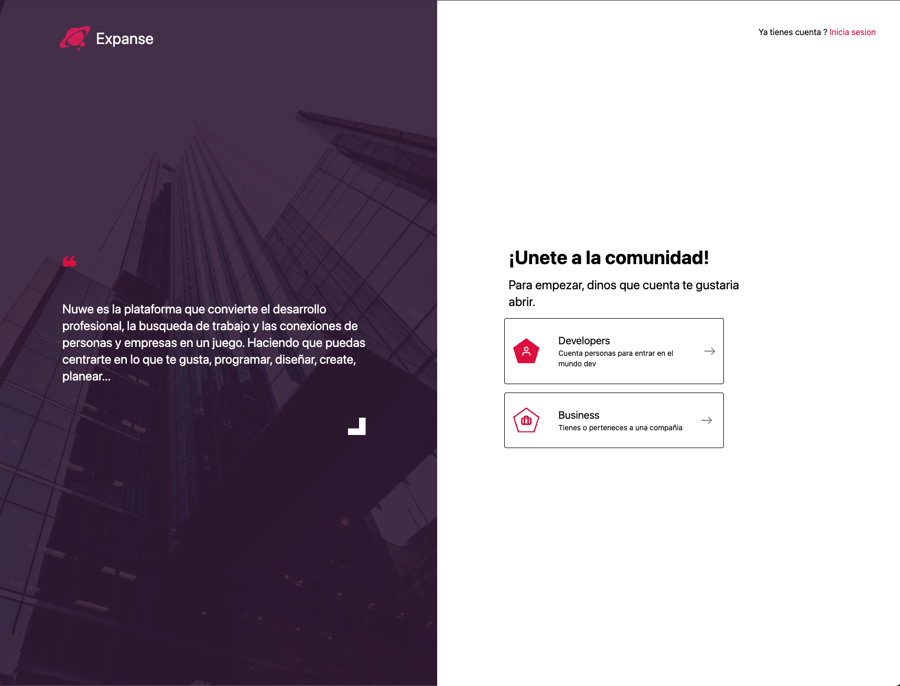

<p align="center">
  <a href="https://bdt.nstlopez.com">
    
  </a>
</p>
<h1 align="center">BDT Hackaton</h1>
<p align="center">Mi proyecto para la BDT hackaton.</p>
<p align="center"><a href="https://bdt.nstlopez.com">Acceder</a></p>
<div align="center">
</div>
<br />
<br>
<p align="center">
  <a href="https://bdt.nstlopez.com">
    
  </a>
</p>

<br>

### Tecnologias utilizadas:

- **Vite**.
- **React**.
- **TailwindCSS**.

### Entorno de Desarrollo

#### ⏳ Instalacion

Para iniciar el entorno de desarrollo solo se necesita instalar las dependencias en la raiz del projecto con el siguiente comando.

```bash
yarn install
```

Se puede usar npm en caso de que no tener `yarn`.

#### 🏗️ Estructura

El proyecto se estructura en 2 directorios principales con subdirectorios dentro.

- `Public`: Se destina a los assets estaticos de la web.
- `src`: Contiene el codigo fuente.
  - `components`: Contiene cada uno de los componentes del form.
  - `hooks`: Contiene los custom hooks creados para el proyecto.
  - `styles`: Contiene las hojas de estilos de Tailwind.
